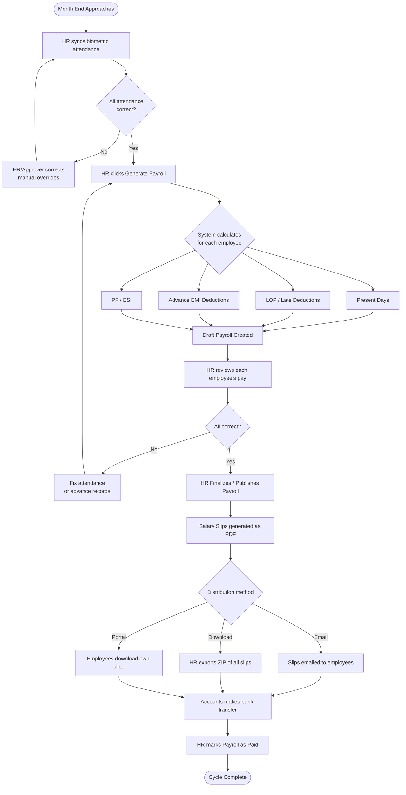
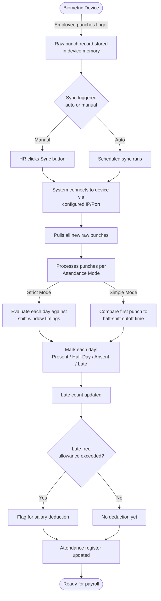
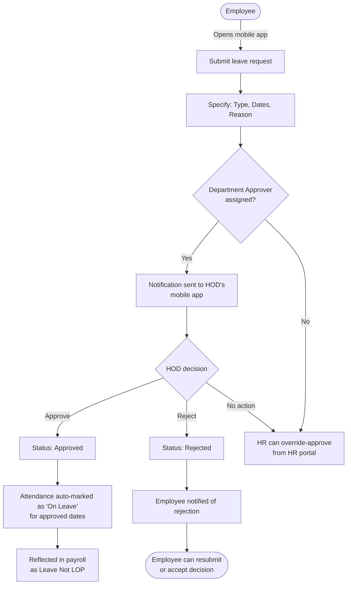
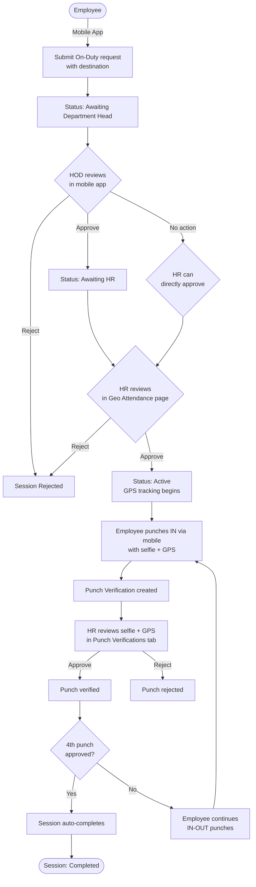
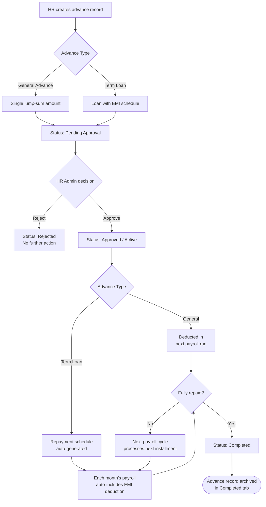

# UK Textiles ERP — Complete Workflow & User Guide

> **A practical, non-technical guide for everyone who uses this system — HR, Admin, Department Heads, and Employees.**

---

## Table of Contents

1. [System Overview](#1-system-overview)
2. [User Roles & Who Does What](#2-user-roles--who-does-what)
3. [How to Log In & Navigate](#3-how-to-log-in--navigate)
4. [HR Module — Page-by-Page Guide](#4-hr-module--page-by-page-guide)
   - [4.1 HR Dashboard](#41-hr-dashboard)
   - [4.2 Employees](#42-employees)
   - [4.3 Attendance](#43-attendance)
   - [4.4 Geo Attendance & On-Duty Tracking](#44-geo-attendance--on-duty-tracking)
   - [4.5 Staff Payroll](#45-staff-payroll)
   - [4.6 Production Payroll](#46-production-payroll)
   - [4.7 Settlement (Advances & Loans)](#47-settlement-advances--loans)
   - [4.8 Recruitment Dashboard](#48-recruitment-dashboard)
   - [4.9 User Management (Department Approvers)](#49-user-management-department-approvers)
   - [4.10 Settings](#410-settings)
5. [Employee Self-Service Module](#5-employee-self-service-module)
   - [5.1 Employee Dashboard](#51-employee-dashboard)
   - [5.2 Leave Management](#52-leave-management)
   - [5.3 Salary Slips](#53-salary-slips)
   - [5.4 Profile](#54-profile)
   - [5.5 Notifications](#55-notifications)
6. [End-to-End Workflow Diagrams](#6-end-to-end-workflow-diagrams)
   - [6.1 Monthly Payroll Workflow](#61-monthly-payroll-workflow)
   - [6.2 Attendance Sync Workflow](#62-attendance-sync-workflow)
   - [6.3 Leave Request Workflow](#63-leave-request-workflow)
   - [6.4 On-Duty (Field Visit) Workflow](#64-on-duty-field-visit-workflow)
   - [6.5 Advance / Loan Workflow](#65-advance--loan-workflow)
7. [Key Concepts Explained](#7-key-concepts-explained)
8. [Common Tasks — Step by Step](#8-common-tasks--step-by-step)
9. [What You Should and Should Not Do](#9-what-you-should-and-should-not-do)
10. [Onboarding Checklist for New Users](#10-onboarding-checklist-for-new-users)

---

## 1. System Overview

The **UK Textiles ERP** is an integrated Human Resources and Payroll management system built specifically for a garments manufacturing environment. It manages the **entire employee lifecycle** — from the moment someone is hired, through day-to-day attendance tracking, leave requests, salary generation, advances, and eventually separation.

### What Does This System Handle?

| Area | What it manages |
|------|----------------|
| **Employee Records** | All employee personal, professional, and document data |
| **Attendance** | Daily punch-in/punch-out from biometric devices; manual overrides; shift tracking |
| **Leave & Permissions** | Requests, approvals, and balances for all types of leave |
| **Payroll — Staff** | Monthly salary generation for office/admin staff with proper deductions |
| **Payroll — Production** | Shift-segment–based payroll for factory floor workers |
| **Advances & Loans** | General and term-loan cash advances with automatic EMI deduction from payroll |
| **Geo-Attendance** | GPS-based tracking for employees on field/client visits ("On-Duty") |
| **Recruitment** | Vacancy tracking, department headcount, new joinee monitoring |
| **Documents** | Auto-generation of Offer Letters, Appointment Letters, ID Cards, Salary Slips |
| **System Settings** | Company profile, payroll config, biometric devices, backup/restore |

### Two Types of Users

The system is split into two separate portal views:

- **HR Portal** — Full management view used by HR staff, admins, and management.
- **Employee Portal** — A simplified self-service view where individual employees check their own attendance, apply for leave, and download their salary slips.

---

## 2. User Roles & Who Does What

### Role Hierarchy

```
Super Admin
    │
    └── Admin (Full HR access)
            │
            ├── HR Staff (access per assigned modules)
            │
            ├── Department Heads / Approvers (mobile app approval)
            │
            └── Employees (self-service portal only)
```

### Role Descriptions

#### 🔑 Super Admin
- Has unrestricted access to every feature in the system.
- Is the only role that can perform **automated database restores** (restoring from a backup file).
- Manages all other user accounts and permission levels.
- Should be used sparingly — only for system-level operations.

#### 👤 Admin / HR Admin
- Full access to all HR modules: employees, attendance, payroll, settings.
- Creates new employee records and manages the full employee lifecycle.
- Runs payroll generation and issues salary slips.
- Approves or rejects advances/loans.
- Sets up biometric devices and attendance policies.
- Configures document templates (offer letters, ID cards, etc.).
- Manages backup and data integrity.

#### 👥 HR Staff (Restricted Access)
- Access to specific HR modules as assigned by the admin.
- Each module can be set to **Full Access**, **View Only**, or **Hidden** for each HR user.
- Examples: An HR staff member may have full access to Attendance but only view-only access to Payroll.
- Permissions are managed via **Account Management** (accessible to Admin).

#### 🏗️ Department Head / Approver (HOD)
- Not a separate login type — these are **regular employees** who have been designated as approvers via **User Management**.
- They use the **mobile app** to approve or reject:
  - Leave requests
  - Permission/half-day requests
  - Attendance correction requests
  - Resignation requests
  - On-Duty (field visit) sessions
- They can be assigned to cover specific departments or individual employees.

#### 👷 Employee
- Has access only to the Employee Self-Service portal.
- Can view their own attendance, leave balances, and salary slips.
- Can apply for leave or permission through the mobile app.
- Cannot see any other employee's data.

---

## 3. How to Log In & Navigate

### Logging In
1. Open the application in a web browser.
2. Enter your **Employee Code** (or username) and **Password**.
3. The system automatically redirects you to the correct portal based on your role:
   - HR staff → HR Portal
   - Regular employees → Employee Portal

### HR Portal Navigation
The HR portal has a **sidebar** on the left with sections for each module. On mobile, tap the hamburger menu (☰) in the top-left to open it.

**Important:** If a module shows a banner reading *"View only — browse and inspect freely, changes can't be saved,"* it means your account only has read access for that section. You can still see all the data, but cannot make any changes.

### Session & Security
- Sessions expire after a period of inactivity; you will be redirected to the login page.
- Always **log out** when using a shared computer.

---

## 4. HR Module — Page-by-Page Guide

---

### 4.1 HR Dashboard

**What it's for:** The first page you see after logging in as HR. It gives a real-time overview of the most important numbers across the entire organization.

**What you see:**

| Card | What it shows |
|------|--------------|
| Total Employees | How many active employees are in the system |
| Present Today | How many employees are marked present today (from biometric sync) |
| On Leave | Employees on approved leave today |
| New Joiners (30 days) | Employees who joined in the last 30 days |
| Pending Leaves | Leave requests waiting for approval |
| Pending Approvals | All pending action items |
| Biometric Sync | Status of the last biometric device sync |

**Quick Actions:** The dashboard has shortcuts to common tasks:
- Sync Attendance (pull today's data from fingerprint machines)
- Go to Employee list
- Start Payroll generation

**When to use it:** Start here every day to check the overall pulse of the organization and spot urgent items.

---

### 4.2 Employees

**What it's for:** The complete employee directory. This is where all employee records live.

#### Employee List View
- Displays all employees with their photo (if uploaded), name, employee code, department, designation, and status.
- Use the **search bar** to find an employee by name, code, or department.
- Filter by **Active / Inactive / All**.
- Filter by **Department** or **Employment Type**.

#### Adding a New Employee
Click **Add Employee** (top right). Fill in:
- Personal details: Name, date of birth, gender, blood group, contact info
- Professional details: Employee code, department, designation, date of joining
- Salary details: Basic salary, allowances, PF/ESI membership
- Documents: Upload Aadhaar, PAN, photographs, etc.

> **Important:** The employee code is the system's unique identifier for an employee. It cannot be changed after it's used in any attendance or payroll record. Choose it carefully (e.g., format like `EMP001`).

#### Employee Profile
Click any employee's name to open their full profile. The profile is split into tabs:

| Tab | Contents |
|-----|----------|
| **Overview** | Personal & professional details, contact info |
| **Attendance** | Monthly attendance summary for this employee |
| **Leave** | Leave history and remaining balances |
| **Payroll** | Salary history for this employee |
| **Documents** | Upload/download KYC documents, offer letters, etc. |
| **ID Card** | Preview and generate the employee's ID card |

#### Bulk Operations
On the employee list, select multiple employees using the checkboxes to:
- **Export** employee data to Excel
- **Bulk update** department or designation
- **Deactivate** employees who have left

#### Separating an Employee (Making Inactive)
When an employee resigns or is terminated:
1. Go to their profile.
2. Change their status to **Inactive** and set the Last Working Day.
3. Their attendance will stop being synced from that date.
4. They will no longer appear in payroll generation.
5. Their employee portal login is also disabled.

#### What NOT to do in the Employee section
- ❌ Do not delete an employee record — mark them as Inactive instead, so historical records (attendance, payroll) are preserved.
- ❌ Do not change an employee's code after it has been used in attendance or payroll.
- ❌ Do not add duplicate employees (one person, two records).

---

### 4.3 Attendance

**What it's for:** Tracks daily attendance for all employees. This is the most critical page for payroll accuracy.

#### Understanding Attendance in this System

The system supports two distinct attendance modes, configured in **Settings → Attendance**:

| Mode | How it works |
|------|-------------|
| **Strict Mode** | Uses the biometric punch times to determine Present/Half-Day/Absent based on exact shift windows. An employee must punch IN within a configurable window around their shift start time, and must complete at least the first half of the shift to be marked Present. |
| **Simple Mode** | A cutoff-time–based approach: if the employee's first punch is before a configured time (e.g., 1:30 PM), they are marked for the first half. After that, second half only. |

#### The Biometric Sync Pipeline

This is a background process that automatically fetches raw punch records from the fingerprint devices and processes them into proper attendance records.

**Sync Status Indicators:**
- 🟢 **Synced** — Latest records fetched and processed
- 🟡 **Syncing** — Currently running
- 🔴 **Error** — Something went wrong; check the device connection

**When to sync:**
- The system syncs automatically at regular intervals.
- You can also trigger a manual sync from the Dashboard's quick action button or from the Attendance page.
- Always sync before generating payroll to ensure the data is current.

#### Daily Attendance View
Select a **Month** and **Year** to see the attendance calendar for all employees. Each cell shows:
- ✅ Present
- ½ Half Day
- ❌ Absent
- 🏖️ On Leave (approved)
- 🔴 Late (present but arrived late)

#### Manual Attendance Override
If a biometric record is incorrect (machine malfunction, forgot to punch):
1. Click on the specific attendance cell for that employee and date.
2. Change the status (Absent → Present, etc.) and add a reason.
3. Save the change.

> **Note:** Overrides require a reason and are logged with the name of the HR user who made the change. Depending on configuration, these may require approval from a Department Head first.

#### Late Attendance Policy
Configured in **Settings → Late Detection**:
- A **free allowance** of N lates per month before any deduction begins.
- After that, **slabs** define how many days are deducted per additional late arrival (e.g., "after 3 lates, deduct 0.5 shifts per additional late").
- This is automatically calculated during payroll generation.

#### Without Permission (WP) Policy
Similarly configured — if an employee is absent without a prior leave approval, it's tracked separately and may carry a different deduction slab.

#### Bulk Export
Use the **Export** button to download the full monthly attendance register as an Excel file. This is useful for auditing and record-keeping.

#### What NOT to do in Attendance
- ❌ Do not override attendance without a legitimate reason — every override is auditable.
- ❌ Do not generate payroll before running a final sync for the period.
- ❌ Do not manually change attendance for future dates.

---

### 4.4 Geo Attendance & On-Duty Tracking

**What it's for:** Manages employees who need to visit clients, suppliers, or other locations outside the office ("On-Duty"). Provides GPS-based tracking and punch verification with selfie photos.

#### Four Sub-Sections (Tabs)

---

##### Tab 1: Live Map
**What it shows:** A real-time map with the last known GPS location of every employee who has Live Tracking enabled.

- **Employee list** (left panel) shows all tracking-enabled employees, their department, and how recently their location was updated.
- **Map** (right panel) shows color-coded pins:
  - 🟢 **Teal building pin** — Your company/branch location
  - 🔵 **Blue person pin** — Regular employee
  - 🟠 **Orange person pin** — Employee currently On-Duty (field visit)
  - 🔴 **Red person pin** — Employee using a **simulated/mocked location** (possible GPS spoofing — investigate)
- Click any employee to see their **movement trail** on the map (a line showing where they've been).
- A faint **geofence circle** around the company location shows the attendance boundary.

**When to use:** Monitor field staff in real-time. If an employee's pin shows "Simulated location," take note and verify manually.

---

##### Tab 2: On-Duty Map
**What it shows:** GPS routes for employees who were On-Duty on a selected date (historical view).

- Switch between **All On-Duty** (all field staff for the selected day) and **Single Employee** (detailed route for one person).
- In "Single Employee" mode: select an employee and a date to see their complete travel path with direction arrows, start pin (green flag), and latest position (person pin).

**When to use:** Review where an On-Duty employee traveled. Useful for expense verification or dispute resolution.

---

##### Tab 3: On-Duty Approvals
**What it's for:** Approving or rejecting employee requests to go On-Duty (field visits).

**The Approval Process:**
1. An employee submits an On-Duty request through the mobile app, specifying their destination and purpose.
2. The request first goes to their **Department Head** (HOD) for review.
3. After HOD approval (or if no HOD is assigned), it comes to **HR** for final approval.
4. Once approved, the session becomes **Active** and GPS tracking begins.
5. The employee punches in/out up to 4 times during the visit (IN-OUT-IN-OUT).
6. When the 4th punch is approved, or the employee manually ends the session, it becomes **Completed**.

**Status Labels:**
| Status | Meaning |
|--------|---------|
| Awaiting Department Head | HOD hasn't reviewed it yet |
| Awaiting HR | HOD approved; waiting for HR |
| Active | Approved and employee is currently on field |
| Completed | Session ended |
| Rejected | Denied at any stage |

**Actions available:** For Pending sessions, you can click **Approve** or **Reject**. HR can approve even if the HOD hasn't acted yet (this finalizes it directly).

---

##### Tab 4: Punch Verifications
**What it's for:** Reviewing selfie photos and GPS coordinates submitted by the employee at each punch during an On-Duty session.

Each punch generates:
- A **selfie photo** (taken in-app, cannot be uploaded from gallery)
- A **GPS coordinate** at the moment of the punch
- The **time** of the punch

For each pending punch verification:
1. Click **View Photo** to see the selfie.
2. Check the GPS coordinates shown.
3. Click **Approve** or **Reject**.

> ⚠️ If a punch shows **"Simulated location"** in red, the GPS data was generated by an emulator or GPS spoofer. Reject this punch and investigate.

---

##### Tab 5: Tracking Settings
**What it's for:** Control which employees have Live GPS tracking enabled.

- Enable or disable tracking for individual employees using the toggle switch.
- Use **Enable All / Disable All** for bulk changes.
- Only enable tracking for employees who routinely travel On-Duty — not for office staff who stay at the premises.

---

### 4.5 Staff Payroll

**What it's for:** Generate and manage monthly salary payments for all **Staff employees** (non-production, office/admin roles).

#### Key Concepts

**Payroll Session:** A payroll session is one month's pay cycle. It goes through these stages:
1. **Not Generated** — Month not yet processed
2. **Generated / Draft** — Payroll run, available for review
3. **Published / Finalized** — Locked and sent to employees
4. **Paid** — Marked as payment complete

**What affects the salary calculation:**
- Basic salary + configured allowances (HRA, transport, etc.)
- Actual present days (calculated from attendance)
- LOP (Loss of Pay): absent days that reduce salary
- Late attendance deductions (per the Late Detection policy in Settings)
- Without-Permission (WP) deductions
- Approved advance repayments (EMI deductions)
- PF and ESI deductions if applicable

#### Generating Payroll (Step by Step)

1. **Verify Attendance First:** Go to Attendance page, sync all biometric data, and review for the pay period.
2. Go to **Staff Payroll**.
3. Click **Generate Payroll** and select the Month and Year.
4. The system processes all active staff employees and creates draft salary records.
5. **Review the draft:** Check each employee's computed salary. You can see present days, LOP days, deductions, and final net pay.
6. If any corrections are needed, go back to Attendance and fix them, then **Re-generate**.
7. Once satisfied, click **Publish / Finalize** to lock the payroll.
8. After payment is made, mark the payroll as **Paid**.

#### Salary Slips
- After finalizing, salary slips can be **downloaded** as PDF for each employee.
- Use **Bulk Export** to download all slips for the month as a ZIP file.
- Alternatively, slips can be **emailed** to employees (requires SMTP to be configured in Settings), or sent via **WhatsApp** if WhatsApp is configured (see `backend.md`).
- Employees can also download their own slips from the Employee portal.

#### Legacy Sessions
The payroll page also shows older sessions from before the current payroll system was implemented. These are historical records only.

#### What NOT to do in Staff Payroll
- ❌ Do not finalize payroll if attendance data is not yet synced.
- ❌ Do not publish payroll if any employee's pay looks incorrect — re-check attendance first.
- ❌ Do not generate payroll twice for the same month (this creates duplicate records).

---

### 4.6 Production Payroll

**What it's for:** Identical in purpose to Staff Payroll, but designed for **Production employees** (factory floor workers) who follow a different attendance and shift structure.

#### Key Difference: Shift Segments

Production attendance is broken into **named shift segments**:
- **First Half** (e.g., 8:30 AM – 12:30 PM)
- **Second Half** (e.g., 1:30 PM – 5:30 PM)
- **Extra/Overtime** (e.g., 5:50 PM – 8:00 PM)

Each segment is worth a specific pay proportion. If a production worker only attends one segment, they are paid only for that segment — not a full day.

#### Production Pay Period

Production payroll uses a **custom period** (configurable — e.g., runs from the 26th of one month to the 25th of the next) rather than a strict calendar month. This is configured in **Settings → Production Payroll**.

#### Shift Configuration

Multiple **named shifts** can be set up (e.g., Day Shift, Night Shift) with their own in/out times. Each production employee is assigned to a shift, and their attendance is evaluated against that shift's windows.

#### Generating Production Payroll

Same general flow as Staff Payroll:
1. Sync attendance.
2. Click **Generate** for the production period.
3. Review the draft — each employee shows their segment breakdown.
4. Finalize and export slips.

---

### 4.7 Settlement (Advances & Loans)

**What it's for:** Managing cash advances and term loans given to employees, with automatic monthly repayment through payroll deduction.

#### Two Types of Advances

| Type | Description |
|------|-------------|
| **General Advance** | A one-time salary advance. The full amount is deducted in the next payroll run (or as configured). No structured EMI schedule. |
| **Term Loan** | A structured loan with a fixed repayment period (e.g., ₹12,000 over 6 months = ₹2,000/month). An automatic EMI deduction schedule is generated on approval. |

#### Advance Lifecycle

1. **HR creates the advance record** — enter the employee code, amount, type, purpose, and (for term loans) the repayment schedule.
2. The advance appears in **Pending Approval**.
3. HR Admin **approves or rejects** the advance.
4. On approval, a **repayment schedule is generated** showing which month each installment will be deducted.
5. Each payroll run automatically includes the scheduled deduction for that month.
6. Once fully repaid, the advance is moved to **Completed**.

#### Summary Cards

At the top of the page (changes based on which tab is active):
- **Pending:** Number of requests awaiting approval and total amount
- **General (Active):** Total outstanding general advances
- **Term Loan (Active):** Total outstanding loans and combined monthly EMI
- **Completed:** Total amounts fully repaid
- **Rejected:** Advances that were denied

#### Repayment Detail

Click any advance to open its detail drawer, which shows:
- Employee info (name, department, contact)
- Loan details: total amount, amount repaid so far, outstanding balance, and a progress bar
- Month-by-month repayment schedule with status (pending/deducted)

#### What NOT to do in Settlement
- ❌ Do not approve a term loan without verifying the EMI fits within the employee's salary.
- ❌ Do not delete an advance that is in progress — mark it rejected or close it after full repayment.

---

### 4.8 Recruitment Dashboard

**What it's for:** A snapshot of staffing levels, vacancies, and recent HR activity. Primarily used by management and HR to monitor hiring needs.

#### KPI Cards (Click for Details)

| Card | Shows | Urgent if... |
|------|-------|-------------|
| **Total Staff** | Number of active staff employees | — |
| **Departments** | Number of departments | — |
| **Recent Leaves** | Employees on leave in the last 30 days | — |
| **New Joinees** | Employees who joined in the last 30 days | — |
| **Open Roles** | Job positions currently being recruited | — |
| **Pending Resignations** | Resignation requests not yet reviewed | > 0 (flashes red) |
| **Positions Needed** | Total vacant positions across all departments | > 0 (flashes red) |

#### Department Headcount Table

Shows for each department:
- **Current Count:** How many employees are active right now
- **Required Count:** How many are needed (set in department settings)
- **Vacancy:** The shortfall (Required − Current)
- **Status:** "Fully Staffed" ✅ or "Needs Hiring" 🔴

> If the Required count shows 0, it means no headcount target has been set for that department yet. Set it in **Settings → Company** or the department configuration.

#### Recent Joinees Section
Cards showing each employee who joined in the last 30 days — their name, department, and join date.

#### What to do when you see "Pending Resignations"
Click the Pending Resignations card — it will tell you to go to the **Resignations** section (accessible from the employee's profile) to review and approve or reject them.

---

### 4.9 User Management (Department Approvers)

**What it's for:** Designating certain employees as **Department Approvers** who can action leave, permission, and other requests through the mobile app — without giving them full HR portal access.

This is how the system enables a **Department Head workflow** without creating separate HR accounts for every manager.

#### The Three-Step Setup

**Step 1: Create User**
- Click **Create User**.
- Search for and select the employee who should become an approver.
- Choose which approval types they can handle (all are enabled by default):
  - ✅ Approve leave requests
  - ✅ Approve permission requests
  - ✅ Approve resignations
  - ✅ Approve attendance edits
  - ✅ Approve casual leave
  - ✅ Approve On-Duty requests

**Step 2: Assign Departments / Employees**
- Click on the approver to open their detail dialog.
- Under **Assigned Departments**, add the departments they are responsible for — they will then see all requests from employees in those departments.
- Under **Individual Employees**, assign specific employees from other departments (cross-department assignments).

**Step 3: They Act via Mobile App**
- The assigned approver logs into the mobile app.
- They see an **Approvals** tab where all pending requests from their assigned teams appear.
- They can approve or reject with a single tap.

#### Managing Approvers

| Action | How |
|--------|-----|
| Temporarily disable | Click **Deactivate** on the approver card |
| Restore | Click **Activate** |
| Remove permanently | Click the 🗑️ trash icon |
| Change permissions | Open the approver detail, click permission buttons to toggle |

#### What NOT to do in User Management
- ❌ Do not give someone Department Approver access if they haven't been briefed on the approval workflow — unapproved or incorrectly approved requests affect payroll.
- ❌ Do not forget to assign departments after creating the user — without a department or individual employee assignment, they won't see any requests.

---

### 4.10 Settings

**What it's for:** System-wide configuration. Changes here affect how attendance is calculated, how payroll is run, how documents look, and how the system is backed up.

> **Who should use this:** Only Admin and Super Admin should make changes in Settings. Most tabs are restricted by permission.

The Settings page is divided into the following tabs:

---

#### Company Profile
Configure the organization's identity, which appears on all generated documents:
- Company Name, Tagline, Address, Phone, Email, Website
- GSTIN, PAN, Registration Number
- Company Logo (uploaded here; used on salary slips, ID cards, letters)

---

#### Attendance Settings

**Sub-tab: Staff**
| Setting | What it does |
|---------|-------------|
| Attendance Mode | **Strict** (shift-window based) or **Simple** (cutoff-time based) |
| Punctuality Window | How many minutes before/after shift start counts as "on time" (Strict mode) |
| Half-Shift Reference Time | The time used to determine if an employee qualifies for half-day |
| Grace Minutes | Buffer after shift start before a punch counts as "late" |
| Lunch Duration | How long the lunch break is (affects half-day calculation) |

**Sub-tab: Production**
Separate window times for each shift segment (First Half, Second Half, Extra time). Changes here determine how production attendance is counted in payroll.

---

#### Late Detection Policy

Configures the automatic late penalty rules:
- **Free Allowance:** Number of late arrivals allowed per month before any deduction.
- **Late Slabs:** After the free allowance is used, each additional late arrival triggers a salary deduction. Example: "After 3 lates total, each additional late = 0.5 shift deduction."
- **Without-Permission (WP) Slabs:** Separate table for unplanned absences (no prior leave approval). Same structure as late slabs.

---

#### Biometric Devices

List of all fingerprint machines connected to the system:
- **Add a Device:** Enter the device's IP address, port, and a label name.
- **Enable/Disable:** Toggle specific devices on or off.
- **Delete:** Remove a device that is no longer used.
- The attendance sync pipeline fetches data from all enabled devices.

> Each device needs to be on the same network as the server for the sync to work. See `biometric-integration.md` for the technical detail on how this sync actually works.

---

#### ID Cards

Customize the visual design of employee ID cards:
- Background color, text color, font style
- Logo override (if a different logo from the Company Logo is needed for ID cards)
- Preview button to see a sample card before saving

---

#### Documents

Customize the visual theme for each type of generated document:
- **Offer Letter:** Colors, font style (Serif / Sans), footer tagline, logo
- **Appointment Letter:** Same options
- **Salary Slip:** Same options, plus watermark toggle

Changes here apply to all **newly generated** documents. Previously generated documents are not affected.

---

#### Payroll (Staff)

| Setting | What it controls |
|---------|-----------------|
| Pay Cycle | The start and end dates of the monthly pay period for staff |
| PF Rate | Employer and employee provident fund contribution percentage |
| ESI Rate | Employee State Insurance contribution percentage |
| Payable Components | Which allowances are active (HRA, transport, medical, etc.) |

---

#### Production Payroll

| Setting | What it controls |
|---------|-----------------|
| Production Period | The non-calendar-month pay period (e.g., 26th to 25th) |
| Next Period Date | The upcoming period's dates |
| Shift Configuration | Define named shifts with their first-half/second-half/extra time windows |

---

#### Salary Slip

- Customize what appears on the salary slip PDF
- Toggle visibility of specific components or deductions
- Set the document color theme

---

#### SMTP (Email)

Configure the outgoing email server so the system can automatically send:
- Salary slips to employees
- Notifications and alerts

Required fields: SMTP host, port, username/email, password, TLS/SSL setting.

---

#### WhatsApp

Shows the WhatsApp Cloud API connection status (configured entirely via server `.env`, not editable here — see `backend.md`), and lets HR set which pre-approved message template is used for each document type (Salary Slip, ID Card, Offer/Experience/Resignation Letters). Message wording itself is fixed by Meta's template-approval process; only the template choice and language are editable here.

---

#### Backup & Restore

**Manual Backup:** Click **Run Backup Now** to immediately create a full backup of all database data and uploaded files. The backup is saved as a `.zip` file on the server.

**Scheduled Backup:**
- Enable automatic backups.
- Set the time of day (e.g., 2:00 AM).
- Choose days (every day, or specific weekdays).
- Set how many backups to keep (old ones are auto-deleted after the limit).

**Google Drive (Optional):**
- Connect a Google Drive Shared Drive folder using a Service Account.
- Once enabled, every backup is also uploaded to Drive as an offsite copy.
- Full setup instructions are shown within the settings panel (click "Show Complete Instructions").

**Restore Backup:**
This is a **destructive, irreversible operation** — only Super Admins can perform automated restores.

There are two restore paths:
1. **Guided (Script):** Download a `.bat` script and run it manually after stopping the server. This is the safer, always-available method.
2. **Automated (Super Admin only):** The system restores the database while briefly taking the application offline. It automatically saves a safety backup of the current state before restoring.

> ⚠️ Before restoring, understand that any data created **after** the backup date will be lost from the live system. If the backup you're about to restore is older than the current live data, the system shows a warning telling you exactly what will be discarded before you confirm. The system also creates a pre-restore safety backup automatically, but you should only restore when absolutely necessary.

---

## 5. Employee Self-Service Module

Employees access a simplified portal showing only their own data. They cannot see any other employee's records.

---

### 5.1 Employee Dashboard

**What it shows:**
- A welcome greeting with today's date.
- Four summary cards:
  - **Working Days:** Total working days in the current period
  - **Present Days:** How many days they were present
  - **Pending Leaves:** Leave requests awaiting approval
  - **Approved Leaves:** Leave requests that were approved

- **Attendance Activity Graph:** A GitHub-style heat map showing the last 52 weeks of attendance. Green cells = present days, red cells = absent days.
- **Recent Salary:** Last few months' salary amounts and payment status.

---

### 5.2 Leave Management

**What it shows:** The employee's full leave history and pending requests.

**Applying for Leave (via Mobile App):**
Employees submit leave requests through the mobile app, not the web portal. The request specifies:
- Leave type (Earned Leave, Sick Leave, Casual Leave, etc.)
- Start and end dates
- Reason

**Leave Approval Flow:**
1. Employee submits request via mobile app.
2. Their assigned Department Approver sees it in the mobile app's Approvals tab.
3. Approver approves or rejects.
4. If approved, the attendance record for those dates is automatically marked as Leave.

**Leave Balances:** The portal shows the current balance for each leave type.

---

### 5.3 Salary Slips

**What it shows:** A list of all processed salary months with:
- Month and Year
- Payroll type (staff / production)
- Net pay amount
- Status (Draft / Paid)

**Downloading a Slip:**
- Click on any month to download the salary slip as a PDF.
- The PDF is generated with the company branding configured in Settings.

---

### 5.4 Profile

**What it shows:** The employee's own HR record — the same data HR manages, but read-only for the employee.

Sections visible:
- Personal information (name, DOB, gender, blood group)
- Contact details (phone, email, address)
- Professional details (employee code, department, designation, join date)
- Emergency contact
- Bank details (for salary credit — view only)

If any details need to be updated, the employee must request HR to change it.

---

### 5.5 Notifications

**What it shows:** System notifications relevant to the employee, such as:
- Leave approval/rejection
- Payroll processed
- Any HR announcements

Notifications are shown with a timestamp. Read notifications appear dimmer than unread ones.

---

## 6. End-to-End Workflow Diagrams

---

### 6.1 Monthly Payroll Workflow



---

### 6.2 Attendance Sync Workflow



---

### 6.3 Leave Request Workflow



---

### 6.4 On-Duty (Field Visit) Workflow



---

### 6.5 Advance / Loan Workflow



---

## 7. Key Concepts Explained

### What is LOP (Loss of Pay)?
LOP means a day is deducted from the employee's salary because they were absent without an approved leave. If an employee takes 2 days off without prior leave approval, those 2 days are LOP days and their salary is reduced proportionally (e.g., Basic ÷ 30 × 2 LOP days = deduction amount).

### What is the Difference Between Leave and WP (Without Permission)?
- **Leave:** Employee submitted a formal request, it was approved. No salary penalty (unless leave balance is exhausted).
- **WP (Without Permission):** Employee was absent with no prior approval. Treated more strictly — may have a separate deduction slab that kicks in faster.

### What is a Payroll Session?
One complete pay cycle for one month. It progresses through: Not Generated → Generated (Draft) → Published (Finalized) → Paid.

### What is Biometric Sync?
The automatic process of pulling punch-in/punch-out records from fingerprint devices over the network and converting them into attendance records. Must be done before payroll generation.

### What is a Shift Segment (Production)?
For production/factory workers, the workday is divided into segments (First Half, Second Half, Extra). Workers are paid per segment attended, not per full day. This allows precise, fair payment even if a worker only attends part of a shift.

### What is On-Duty?
When an employee leaves the office to visit a client, supplier, or another site for work purposes, they submit an "On-Duty" request. This differs from Leave — the employee is working but not at the office. Their attendance is still marked as Present, and GPS tracking verifies their location.

### What is a Department Approver (HOD)?
An employee — usually a team leader or department head — designated to approve leave/permission requests from their team via the mobile app. They do not have HR portal login access; they only act through the mobile app Approvals tab.

### What is a View-Only Permission?
When an HR user's permission for a specific module is set to "View Only," they can see all the data in that module but all action buttons (Add, Edit, Delete, Generate, etc.) are disabled. A yellow banner at the top of the page indicates this.

---

## 8. Common Tasks — Step by Step

### Task: Adding a New Employee
1. Go to **HR Portal → Employees**.
2. Click **Add Employee** (top right).
3. Fill in all required fields (marked with red asterisk *): Name, Employee Code, Department, Date of Joining, Basic Salary.
4. Upload documents (Aadhaar, PAN, Photo).
5. Click **Save**.
6. Go back to the employee list and verify the new record appears.
7. If this employee will use biometric attendance, ensure their fingerprint is enrolled in the device.

---

### Task: Correcting an Incorrect Attendance Record
1. Go to **HR Portal → Attendance**.
2. Select the correct Month and Year.
3. Find the employee in the list.
4. Click the specific date cell that shows incorrect data.
5. Change the status (e.g., from Absent to Present).
6. Enter a reason for the override.
7. Click **Save**.
8. The payroll calculation for that month will now use the corrected value.

---

### Task: Processing Monthly Payroll (Staff)
1. Confirm the month's attendance is complete and synced.
2. Go to **Staff Payroll**.
3. Click **Generate Payroll**, select the Month and Year, and confirm.
4. Wait for the generation to complete (this may take a few seconds).
5. Review each employee's row — check the Present Days, LOP, Deductions, and Net Pay.
6. If any row looks wrong, fix the underlying attendance and regenerate.
7. Click **Finalize / Publish** to lock the payroll.
8. Use **Bulk Export Slips** to download all PDF salary slips.
9. After payment, click **Mark as Paid**.

---

### Task: Approving an Advance Request
1. Go to **HR Portal → Settlement**.
2. The **Pending Approval** tab shows all new advance requests.
3. Click on a request card to open the detail drawer.
4. Review the employee info, advance type, amount, and purpose.
5. Click **Approve** to approve (this auto-generates the repayment schedule if it's a term loan).
6. Click **Reject** to decline.

---

### Task: Setting Up a New Department Approver
1. Go to **HR Portal → User Management**.
2. Click **Create User**.
3. Search for the employee's name or code.
4. Check which approval types they should handle.
5. Click **Add User**.
6. In the user list, click on the newly created user.
7. In the detail dialog, click **Add department** and select the departments they cover.
8. Tell the employee to log into the mobile app — they will now see an Approvals tab.

---

### Task: Running a Manual Backup
1. Go to **HR Portal → Settings → Backup**.
2. Click **Run Backup Now**.
3. A backup file will be created on the server.
4. If Google Drive is configured and enabled, it will also upload a copy there.
5. Verify the backup appears in the "Recent Backups" list with the current date.

---

## 9. What You Should and Should Not Do

### ✅ DO

| Section | Best Practice |
|---------|--------------|
| **Attendance** | Sync biometric data daily. Don't let it fall behind more than a few days. |
| **Payroll** | Always review the draft payroll before finalizing. Spot-check a few employees manually. |
| **Employees** | Keep employee records updated whenever personal or professional details change. |
| **Advances** | Always set a realistic repayment schedule — one that fits within the employee's monthly net salary. |
| **Settings** | Test document templates with the **Preview** button before saving changes. |
| **Backup** | Enable scheduled backups. Keep at least 7–14 days of backup history. |
| **User Management** | Assign departments to approvers immediately after creating them. |
| **Geo Attendance** | Investigate any "Simulated Location" alerts before approving that punch. |

### ❌ DO NOT

| Section | Avoid This |
|---------|-----------|
| **Attendance** | Do not change attendance records without a documented reason. Every override is logged. |
| **Attendance** | Do not generate payroll before syncing the last day's biometric data. |
| **Employees** | Do not delete employee records — always mark them Inactive. |
| **Employees** | Do not assign the same Employee Code to two different people, ever. |
| **Payroll** | Do not generate payroll twice for the same month — always check if it's already been generated. |
| **Payroll** | Do not finalize payroll if you're unsure about any record. Re-check first. |
| **Advances** | Do not approve advances where the EMI exceeds what the employee can afford. |
| **Settings** | Do not change payroll settings (PF rates, pay components) mid-month if payroll is not yet generated. |
| **Backup** | Do not restore from a backup unless it is truly necessary — it will erase all data created after the backup date. |
| **User Management** | Do not give Department Approver access to employees who haven't been briefed. |

---

## 10. Onboarding Checklist for New Users

### For a New HR Staff Member (First Day)
- [ ] Get your login credentials from the Admin/Super Admin.
- [ ] Log in and note which modules you have access to (some may be View Only — that's fine).
- [ ] Go to **Employees** and familiarize yourself with how employee records are structured.
- [ ] Go to **Attendance** and observe how the monthly grid looks.
- [ ] Ask your Admin which day of the month payroll is generated and what your role is in that process.
- [ ] Read through the **Late Detection** policy in Settings so you understand how deductions work.
- [ ] Ask which biometric devices are in use and how to check the sync status.

### For a New Department Approver (First Day on Mobile App)
- [ ] Get the mobile app installed on your phone.
- [ ] Log in using your regular employee credentials.
- [ ] Go to the **Approvals** tab — you should see requests from your assigned department.
- [ ] Understand that your approvals affect payroll — only approve genuine requests.
- [ ] Respond to requests promptly — pending requests block HR from closing the monthly process.
- [ ] If you see requests from employees NOT in your department, contact HR — your assignments may need adjustment.

### For a New Employee (First Day — Self-Service Portal)
- [ ] Get your login credentials from HR.
- [ ] Log in at the company web address and confirm you see the Employee Dashboard.
- [ ] Verify your attendance activity graph shows your attendance correctly.
- [ ] Download the mobile app (if provided by HR) for submitting leave requests.
- [ ] Locate your most recent salary slip in the **Salary** section.
- [ ] Review your **Profile** for any errors and report them to HR.

---

### System at a Glance — Quick Reference Card

| I want to... | Go to... |
|-------------|---------|
| See today's overall attendance | HR Dashboard |
| Add a new employee | Employees → Add Employee |
| Fix an attendance record | Attendance → select month → click cell |
| Run payroll for this month | Staff Payroll / Production Payroll → Generate |
| Download all salary slips | Staff Payroll → Bulk Export |
| Approve an advance request | Settlement → Pending Approval tab |
| Check who is on field duty today | Geo Attendance → Live Map tab |
| Approve an On-Duty request | Geo Attendance → On-Duty Approvals tab |
| See which departments are understaffed | Recruitment Dashboard |
| Give a team leader approval powers | User Management → Create User |
| Change how late attendance is penalized | Settings → Late Detection |
| Set up a new fingerprint device | Settings → Devices |
| Backup all data now | Settings → Backup → Run Backup Now |

---

*This document covers the functional workflow of the UK Textiles ERP system as of the current version. For technical setup and deployment, see `backend.md`, `frontend.md`, `deployment-guide.md`, and `clouddeployment.md`. For technical support or system configuration beyond what is described here, contact the system administrator.*
